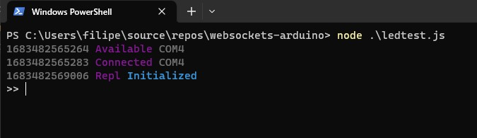
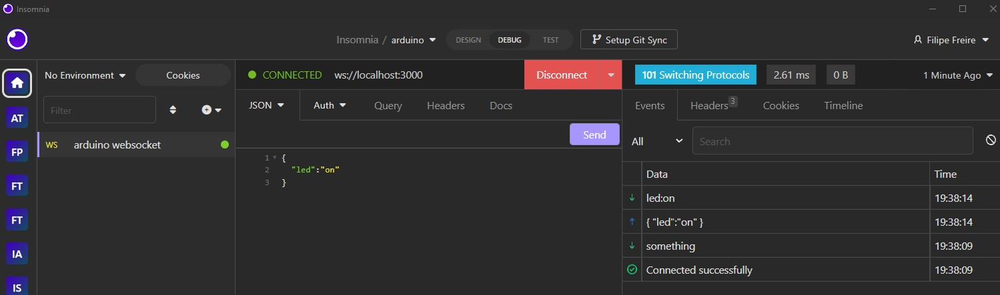
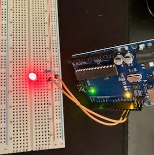

# websockets-arduino

Experiments using arduino and websockets

## Run

```shell
npm i

node ledtest.js
```



Connect to `ws://localhost:3000`, and send:

```json
{
    "led":on
}
```





### Windows problems

- Install Python and Visual Studio (with C++ libs)
- Install `node-gyp` - `npm install -g node-gyp`
- Install `serialport` - `npm install serialport`

## See also

- [https://www.instructables.com/Javascript-robotics-and-browser-based-Arduino-cont/]
- [https://www.makeuseof.com/tag/control-arduino-using-javascript/]
